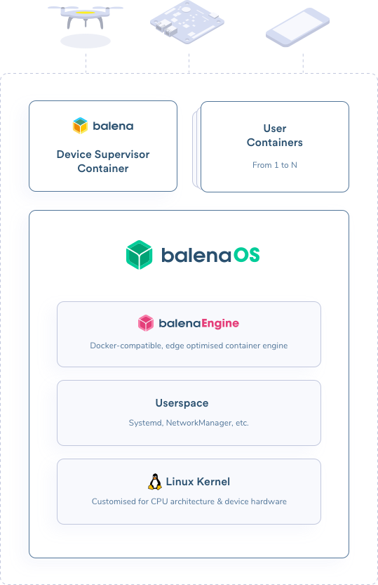

## 2.2 Comparing Solutions - IoT
### Comparison

|        | Open Source | First Release | Last Release | Stars | Test | Issues (open/closed) | Link                                       |
|--------|-------------|---------------|--------------|-------|------|----------------------|--------------------------------------------|
| Balena | Yes         | Oct. 2015     | Dec. 2019    | 471   | Ok   | 37 / 49              | https://github.com/balena-os/balena-engine |

### 2.2.1 Balena
- [https://www.balena.io/](https://www.balena.io/)
- [**Report**](/reports/balena-engine.md)

#### Introduction

##### balenaEngine
balenaEngine is a new container engine purpose-built for embedded and IoT use cases and compatible with Docker containers. Based on Docker’s Moby Project, balenaEngine supports container deltas for 10-70x more efficient bandwidth usage, has 3x smaller binaries, uses RAM and storage more conservatively, and focuses on atomicity and durability of container pulling.

Features:

- Small footprint: 3.5x smaller than Docker CE, packaged as a single binary
- Multi-arch support: Available for a wide variety of chipset architectures, supporting everything from tiny IoT devices to large industrial gateways
- True container deltas: Bandwidth-efficient updates with binary diffs, 10-70x smaller than pulling layers
- Minimal wear-and-tear: Extract layers as they arrive to prevent excessive writing to disk, protecting your storage from eventual corruption
- Failure-resistant pulls: Atomic and durable image pulls defend against partial container pulls in the event of power failure
- Conservative memory use: Prevents page cache thrashing during image pull, so your application runs undisturbed in low-memory situations

##### balenaOS
A bare-bones, Yocto Linux based host OS, which comes packaged with balenaEngine

- The host OS is responsible for kicking off the device supervisor, balena’s agent on your device, as well as your containerized services. Within each service's container you can specify a base OS, which can come from any existing Docker base image that is compatible with your device architecture.
- The base OS shares a kernel with the host OS, but otherwise works independently. If you choose, your containers can be configured to run as privileged, access hardware directly, and even inject modules into the kernel.
- The balena device supervisor runs in its own container, which allows us to continue running and pulling new code even if your application crashes.

##### balenaCloud
The core balena platform encompasses device, server, and client-side software, all designed to get your code securely deployed to a fleet of devices

###### Reference
- [balenaEngine](https://github.com/balena-os/balena-engine)
- [What is balena](https://www.balena.io/what-is-balena)

#### Requirements and Permissions
Compatibility:

- aarch64
- amd64
- armv5e
- armv6l
- armv7hf
- i386

###### Reference
- [balenaEngine](https://www.balena.io/engine)

#### Standards
- balenaEngine will be versioned with the equivalent version of Docker it’s closest to

#### Images
- Docker Images that are compatible with the device architecture
- Container deltas: balenaEngine comes with support for container deltas, a way of computing a binary description of what changed between two images. A delta can be pushed to the standard docker registry, it has the same format as a docker image

###### Reference
- [Container deltas](https://www.balena.io/engine/docs/)

#### Performance
- [Technical comparison](https://www.balena.io/blog/announcing-balena-a-moby-based-container-engine-for-iot/)
- Delta updates allow up to 70x improvement
- Binaries are on average 3.5x smaller
- page cache usage is minimal (with the downside of a slower pull)

#### Security
BalenaOS is a thin Linux environment that supports the balena services and user application containers. BalenaOS is built using Yocto Linux, the de facto standard for building lightweight embedded Linux environments. Using Yocto allows balena to build images that contain no unused or unnecessary code in either userspace or the running kernel, minimizing the device's available attack surface. All balena software running on devices is 100% open source and can be independently audited and verified.

- Device access: every device has an API key that can be used to read information about the device or the application the device is associated with and to allow a device to request an application update
- Runtime management: Balena uses OpenVPN to control the device state (e.g. device reboot, device shutdown, application restart, etc.). Devices only connect outbound to the VPN and all traffic over the VPN is encrypted with TLS. When the VPN is enabled, SSH access is available to the application container. Balena VPN disallows device-to-device traffic and prohibits outbound traffic to the Internet

###### Reference
- [Balena security](https://www.balena.io/docs/learn/welcome/security/)

#### Available Tools
- balenaOS
- balenaCloud

#### Limits
- balenaEngine provides a poor documentation while a good documentation is available for the balena ecosystem
- Some Docker features left out (most needed in cloud deployments and therefore not warranting inclusion in a lightweight IoT-focused container engine):
  - Docker Swarm
  - Cloud logging drivers
  - Plugin support
  - Overlay networking drivers
  - Non-boltdb backed stores (consul, zookeeper, etcd, etc.)