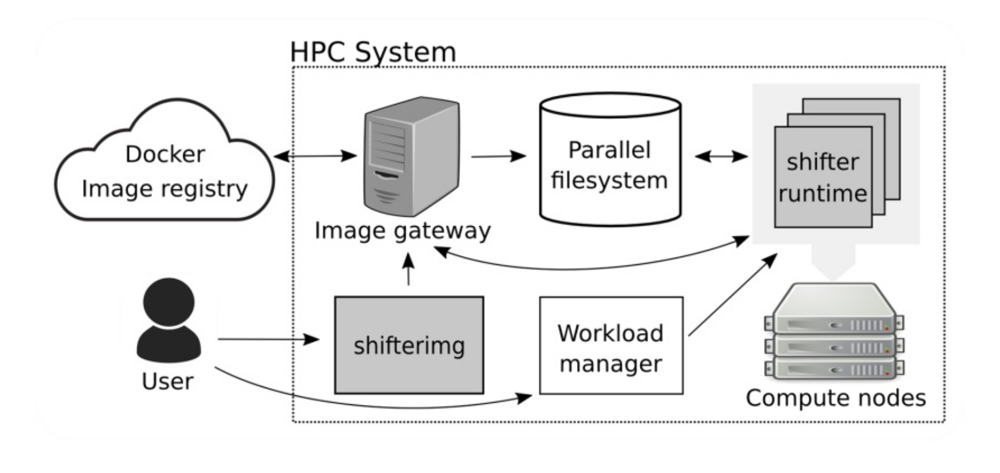
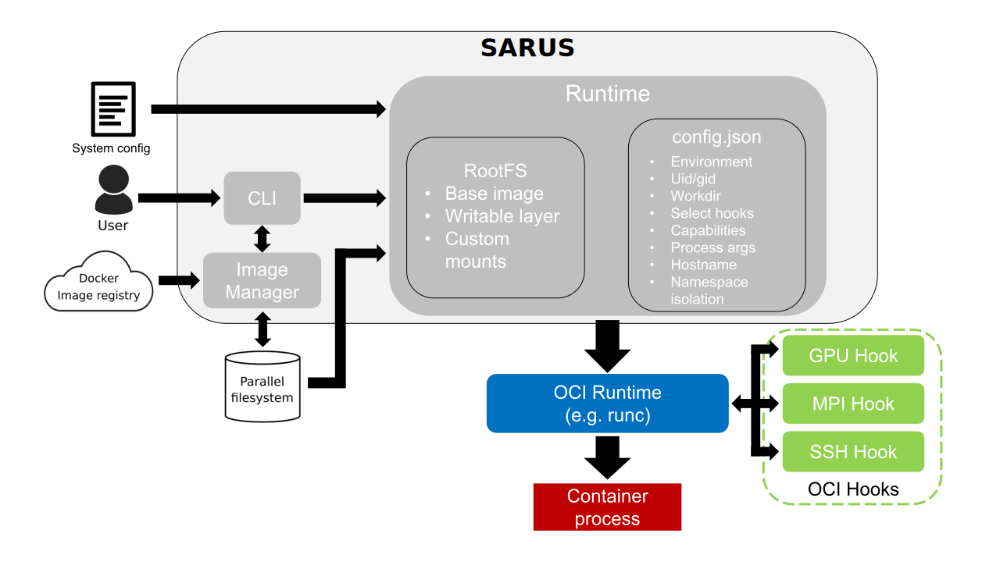

## 2.3 Comparing Solutions - HPC
### Comparison

|              | Open Source | First Release | Last Release | Stars | Test   | Issues (open/closed) | Link                                  |
|--------------|-------------|---------------|--------------|-------|--------|----------------------|---------------------------------------|
| Singularity  | Yes         | Oct. 2015     | Feb. 2020    | 1.6k  | Ok     | 370 / 2250           | https://github.com/sylabs/singularity |
| Shifter      | Yes         | Mar. 2015     | Jan. 2020    | 280   | Not Ok | 33 / 61              | https://github.com/NERSC/shifter      |
| CharlieCloud | Yes         | Jun. 2015     | Mar. 2020    | 171   | Ok     | 117 / 306            | https://github.com/hpc/charliecloud   |
| Sarus        | Yes         | Nov. 2018     | Feb. 2020    | 32    | Ok     | 5 / 1                | https://github.com/eth-cscs/sarus     |

### 2.3.1 Singularity
- [https://sylabs.io/](https://sylabs.io/)
- [**Report**](/reports/singularity.md)

#### Introduction
Singularity is an open source container platform designed to be simple, fast, and secure. Singularity is optimized for compute focused enterprise and HPC workloads, allowing untrusted users to run untrusted containers in a trusted way.

- Secure, single-file based container format
- Support for data-intensive workloads
- Extreme mobility
- Compatibility
- Simplicity
- Security
- User groups

###### Reference
- [https://github.com/sylabs/singularity](https://github.com/sylabs/singularity)

#### 1.Requirements and Permissions
- go
- Singularity requires ~140MiB disk space once compiled and installed.
- 2GB of RAM is recommended when building from source
Full functionality of Singularity requires that the kernel supports:
- overlayFS mounts (minimum kernel >=3.18): required for full flexiblity in bind mounts to containers, and to support persistent overlays for writable containers
- unprivileged user namespaces (minimum kernel >=3.8, >=3.18 recommended): required to run containers without root or setuid privilege

###### Reference
- [system requirements](https://sylabs.io/guides/3.5/admin-guide/installation.html#system-requirements)

#### Standards
- OCI compliant from 3.1.0
- OpenPGP standard to create and manage SIF signatures

###### Reference
- [Singularity 3.1.0 brings in Full OCI Compliance](https://insidehpc.com/2019/02/singularity-3-1-0-brings-in-full-oci-compliance/)

#### Images
Based on SIF: single file based, compressed, cryptographically signed, trusted, and immutable

- can be pulled from:
	- [Singularity Library](https://cloud.sylabs.io/library)
	- [Docker Hub](https://hub.docker.com/)
	- [Singularity Hub](https://singularity-hub.org)
	- local
	- directory
	- definition file

Some comparisons between images from DockerHub and Singularity Library:

| Image  | Version | Arch  | Singularity | DockerHub |
|--------|---------|-------|-------------|-----------|
| Alpine | 3.7     | amd64 | 1.99 MB     | 2.01 MB   |
| Ubuntu | 18.04   | amd64 | 35.38 MB    | 25.49 MB  |
| CentOS | 7       | amd64 | 79.08 MB    | 72.27 MB  |

###### Reference
- [SIF](https://github.com/sylabs/sif)
- [Build a Container](https://sylabs.io/guides/3.5/user-guide/build_a_container.html)

#### Performance
// TODO

#### Security
Singularity uses a number of strategies to provide safety and ease-of-use on both single-user and shared systems.
1. the user inside a container is the same as the user who ran the container. This means access to files and devices from the container is easily controlled with standard POSIX permissions

> The Singularity Runtime enforces a unique security model that makes it appropriate for untrusted users to run untrusted containers safely on multi-tenant resources. When you run a container, the processes in the container will run as your user account. Singularity dynamically writes UID and GID information to the appropriate files within the container, and the user remains the same inside and outside the container, i.e., if you're an unprivileged user while entering the container you'll remain an unprivileged user inside the container.

2. container filesystems are mounted nosuid and container applications run with the PR_NO_NEW_PRIVS flag set.

> Additional blocks are in place to prevent users from escalating privileges once they are inside of a container. The container file system is mounted using the nosuid option, and processes are started with the PR_NO_NEW_PRIVS flag set. This means that even if you run sudo inside your container, you won't be able to change to another user, or gain root priveleges by other means. This approach provides a secure way for users to run containers and greatly simplifies things like reading and writing data to the host system with appropriate ownership.

3. the Singularity Image Format (SIF) supports encryption of containers, as well as cryptographic signing and verification of their content

> You generally do not need admin/sudo to use Singularity containers but you do however need admin/root access to install Singularity and for some container build functions (for example, building from a recipe, or a writable image). This then defines the work-flow to some extent. If you have a container (whether Singularity or Docker) ready to go, you can run/shell/import without root access. If you want to build a new Singularity container image from scratch it must be built and configured on a host where you have root access (this can be a physical system or on a VM). And of course once the container image has been configured it can be used on a system where you do not have root access as long as Singularity has been installed there.

4. SIF containers are immutable and their payload is run directly, without extraction to disk. This means that the container can always be verified, even at runtime, and encrypted content is not exposed on disk. Restrictions can be configured to limit the ownership, location, and cryptographic signatures of containers that are permitted to be run

> A SIF file is an immutable container image that packages the container environment into a single file. SIF supports security and integrity through the ability to cryptographically sign a container, creating a signature block within the SIF file which can guarantee immutability and provide accountability as to who signed it. Singularity follows the OpenPGP standard to create and manage these signatures, and the keys used to create them

###### Reference
- [Security in Singularity](https://sylabs.io/guides/3.5/user-guide/security.html)
- [Singularity Security](https://sylabs.io/guides/3.5/admin-guide/admin_quickstart.html#singularity-security)

#### Available Tools
- [Support for Docker and OCI](https://sylabs.io/guides/3.5/user-guide/singularity_and_docker.html)
- [MPI](https://sylabs.io/guides/3.5/user-guide/mpi.html)
- [GPU support](https://sylabs.io/guides/3.5/user-guide/gpu.html)
- [plugins](https://sylabs.io/guides/3.5/user-guide/plugins.html)
- [cloud library](https://sylabs.io/guides/3.5/user-guide/cloud_library.html)
- [Singularity CRI](https://github.com/sylabs/singularity-cri): consists of two separate services: runtime and image, each of which implements K8s RuntimeService and ImageService respectively
- [Limiting container resources with cgroups](https://sylabs.io/guides/3.5/user-guide/cgroups.html)

#### Limits
// TODO

### 2.3.2 Shifter
- [https://github.com/NERSC/shifter](https://github.com/NERSC/shifter)
- [**Report**](/reports/shifter.md)

#### Introduction
Shifter enables container images for HPC. Shifter allows an HPC system to efficiently and safely allow end-users to run a docker image. Shifter consists of a few moving parts

1. a utility that typically runs on the compute node that creates the run time environment for the application
2. an image gateway service that pulls images from a registry and repacks it in a format suitable for the HPC system (typically squashfs)
3. example scripts/plugins to integrate Shifter with various batch scheduler systems

These components are:

1. Shifter Runtime: Instantiates images securely on compute resources
2. Shifter Image Gateway: Imports and converts images from DockerHub and Private Registries
3. Work Load Manager Integration: Integrates Shifter with WLM

Design Goals:

- User independence: require no administrator assistance to launch an application inside an image
- Shared resource availability (e.g., file systems and network interfaces)
- Leverages or integrates with public image repos (i.e. DockerHub)
- Seamless user experience
- Robust and secure implementation

###### Reference
- [Index](https://github.com/NERSC/shifter/blob/master/doc/index.rst)

#### Requirements and Permissions
- requires the installation of the Image Manager and the Shifter Runtime. The image manager doesn't really do any real work on its own, and the image worker uses only user-space tools to construct images (in the default configuration) so they do not need to run with root privilege

###### Reference
- [Installation](https://github.com/NERSC/shifter/wiki/Installation-Quick-Start-(WIP))

#### Standards
- Docker-compatible container platform

#### Images
- Docker Images
- uses squashfs

Shifter works by converting Docker images to a common format that can then be efficiently distributed and launched on HPC systems. The user interface to shifter enables a user to select an image from their DockerHub account or the NERSC private registry and then submit jobs which run entirely within the container.

Shifter works by enabling users to pull images from a DockerHub or private docker registry. An image manager at NERSC then automatically converts the image to a flattened format that can be directly mounted on the compute nodes. This image is copied to the [Lustre scratch filesystem](http://opensfs.org/lustre/) (in a system area). The user can then submit jobs specifying which image to use. Private images are only accessible by the user that authenticated and pulled them, not by the larger community. In the job the user has the ability to either run a custom batch script to perform any given command supported by the image, or if a Docker entry-point is defined, can simply execute the entry-point

###### Reference
- [Building Shifter Images](https://docs.nersc.gov/programming/shifter/how-to-use/#building-shifter-images)

#### Performance
// TODO

#### Security
Shifter use a great deal of root privilege to setup the container environment. The "shifter" executable is setuid-root, and when run with batch integration the setupRoot/unsetupRoot utilities must be run as root. We are working to reduce the privilege profile of starting Shifter containers to reduce risk as much as possible.

Once a process is launched into the container, processes are stripped of all privilege, and should not be able to re-escalate afterwards.

Shifter enables User Defined Image environment containers. To do this while optimizing I/O on the compute nodes it does require performing several privileged operations on the execution node, both privilege to mount filesystems and rewrite the user space, and privilege to manipulate devices on the system.

Furthermore, because the environment is _user defined_, it is possible that a user could include software which could generate security vulnerabilities if a privileged process accesses such software or resources.

###### Reference
- [Security](https://github.com/NERSC/shifter/blob/master/doc/security.rst)

#### Available Tools
- native GPU support: automatic import of host's CUDA driver and devices
- native MPI support:
	- transparently swap container's MPI libraries with the host's at runtime
	- enables full performance from vendor-specific implementations
	- relies on MPICH ABI compatibility
- Shifter is distributed with a SPANK plugin for SLURM. 

###### Reference
- [shifter docker containers for hpc](https://www.slideshare.net/insideHPC/shifter-docker-containers-for-hpc)

#### Limits
// TODO

### 2.3.3 Charliecloud
- [https://hpc.github.io/charliecloud/index.html](https://hpc.github.io/charliecloud/index.html)
- [**Report**](/reports/charliecloud.md)

#### Introduction
Charliecloud provides user-defined software stacks (UDSS) for high-performance computing (HPC) centers. This "bring your own software stack" functionality addresses needs such as:

- software dependencies that are numerous, complex, unusual, differently configured, or simply newer/older than what the center provides;
- build-time requirements unavailable within the center, such as relatively unfettered internet access;
- validated software stacks and configuration to meet the standards of a particular field of inquiry;
- portability of environments between resources, including workstations and other test and development system not managed by the center;
- consistent environments, even archivally so, that can be easily, reliabily, and verifiably reproduced in the future; and/or
- usability and comprehensibility.

###### Reference
- [What is Charliecloud?](https://hpc.github.io/charliecloud/index.html)

#### Requirements and Permissions
- running the Docker daemon and executing Docker commands require privileged access, this happens on user-managed resources;
- nothing in the Charliecloud workflow requires privileged or trusted processes or daemons on center-managed resources. All privileged steps take place on user systems, and the scripts escalate with sudo as needed

###### Reference
- [paper](https://dl.acm.org/doi/pdf/10.1145/3126908.3126925)

#### Standards
- OCI compliant is in beta with ch-run-oci

###### Reference
- [ch-run-oci](https://hpc.github.io/charliecloud/command-usage.html#ch-run-oci)

#### Images
- Container images can be built using Docker or anything else that can generate a standard Linux filesystem tree

#### Performance
- Charliecloud containers impose minimal performance penalty, because the guest is using the same kernel and devices as the host
- Performance is the same as native in tests because minimal isolation yields direct access to all resources

###### Reference
- [paper](https://dl.acm.org/doi/pdf/10.1145/3126908.3126925)
- [paper](https://www.usenix.org/system/files/login/articles/login_fall17_03_priedhorsky.pdf)

#### Security
Charliecloud uses Linux user namespaces to run containers with no privileged operations or daemons and minimal configuration changes on center resources. This simple approach avoids most security risks while maintaining access to the performance and functionality already on offer.

Charliecloud relies on two things to maintain security:

1. the Linux kernel to enforce access control and other aspects of security
2. the extension that user namespaces will ensure that guest
UIDs are an illusion

###### Reference
- [Interacting with the host](https://hpc.github.io/charliecloud/tutorial.html#interacting-with-the-host)
- [paper](https://dl.acm.org/doi/pdf/10.1145/3126908.3126925)

#### Available Tools
- native MPI support
- inject GPU libraries to a container with [ch-fromhost](https://hpc.github.io/charliecloud/command-usage.html#ch-fromhost)

#### Limits
// TODO

### 2.3.4 Sarus
- [https://github.com/eth-cscs/sarus](https://github.com/eth-cscs/sarus)
- [**Report**](/reports/sarus.md)

#### Introduction
Sarus is a software to run Linux containers on High Performance Computing environments. Its development has been driven by the specific requirements of HPC systems, while leveraging open standards and technologies to encourage vendor and community involvement.

Key features:

- Spawning of isolated software environments (containers), built by users to fit the deployment of a specific application
- Security oriented to HPC systems
- Extensible runtime by means of OCI hooks to allow current and future support of custom hardware while achieving native performance
- Creation of container filesystems tailored for diskless nodes and parallel filesystems
- Compatibility with the presence of a workload manager
- Compatibility with the Open Container Initiative (OCI) standards:
  - Can pull images from registries adopting the OCI Distribution Specification or the Docker Registry HTTP API V2 protocol
  - Can import and convert images adopting the OCI Image Format
  - Sets up a container bundle complying to the OCI Runtime Specification
  - Uses an OCI-compliant runtime to spawn the container process

###### Reference
- [Sarus - An OCI-compatible container engine for HPC](https://sarus.readthedocs.io/en/stable/)

#### Requirements and Permissions
- Sarus is installed on the HPC and it requires root in order to set Sarus as a root-owned SUID program

#### Standards
- designed around the specifications of the OCI

#### Images
- Docker Images
- uses squashfs

#### Performance
- the presented results show no performance degradation when comparing the natively compiled versions with their containerized counterparts

###### Reference
- [Sarus: Highly Scalable Docker Containers for HPC Systems](https://link.springer.com/chapter/10.1007%2F978-3-030-34356-9_5)

#### Security
- Sarus must run as a root-owned SUID executable and be able to achieve full root privileges to perform mounts and create namespaces
- Write/read permissions to the Sarus's centralized repository. The system administrator can configure the repository's location through the centralizedRepositoryDir entry in sarus.json
- Write/read permissions to the users' local image repositories. The system administrator can configure the repositories location through the localRepositoryBaseDir entry in sarus.json
- The configuration script needs to run with root privileges in order to set Sarus as a root-owned SUID program

###### Reference
- [Review permissions required by Sarus](https://sarus.readthedocs.io/en/stable/install/post-installation.html#review-permissions-required-by-sarus)

#### Available Tools
OCI Hooks:

- Native MPICH-Based MPI Support
- NVIDIA GPU Support
- Slurm Scheduler Synchronization

###### Reference
- [Sarus: Highly Scalable Docker Containers for HPC Systems](https://link.springer.com/chapter/10.1007%2F978-3-030-34356-9_5)

#### Limits
// TODO

## 2.2 Conclusion
Docker was developed to answer the particular needs of web service applications, which feature substantially different workloads from the ones typically found in HPC. For this reason, deploying Docker in a production HPC environment encounters significant technical challenges, like missing integration with workload managers, missing support for diskless nodes, no support for kernel-bypassing devices (e.g. accelerators and NICs), no adequate parallel storage driver, and a security model unfit for multi-tenant systems.

A number of container platforms have thus been created to fill this gap and provide Linux containers according to the demands of HPC practitioners, retaining a varying degree of compatibility with Docker.

- Singularity is a container platform designed around an image format consisting of a single file. While it is able to convert Docker images through an import mechanism, it is centered on its own non-standard format and can also build its own images starting from a custom language. Support for specific features, e.g. OpenMPI and NVIDIA GPUs, is integrated into the Singularity codebase.
- Charliecloud is an extremely lightweight container solution focusing on unprivileged containers. It is able to import Docker images, requires no configuration effort from system administrator, and it is a user-space application, achieving high levels of security. Charliecloud’s minimal feature set allows fine-grained control over the customization of the container. On the other hand, it
requires a substantial level of proficiency from the user to set up containers for non-trivial use cases.
- Shifter is a software developed to run containers based on Docker images on HPC infrastructures. It is designed to integrate with the Docker workflow and features an image gateway service to pull images from Docker registries. Shifter has recently introduced the use of configurable software modules for improved flexibility. However, the modules and the executables have to be developed and configured specifically for Shifter.
- Sarus is a tool for HPC systems that instantiates feature-rich containers from Docker images. It fully manages the container life-cycle by: pulling images from registries, managing image storage, creating the container root filesystem, and configuring hooks and namespaces. For instantiating the containers, Sarus leverages on runc, an OCI-compliant kernel-level tool that was originally developed by Docker

###### Reference
- [Sarus: Highly Scalable Docker Containers for HPC Systems](https://link.springer.com/chapter/10.1007%2F978-3-030-34356-9_5)

## 2.3 More information
- [State of HPC containers](https://www.stackhpc.com/the-state-of-hpc-containers.html)